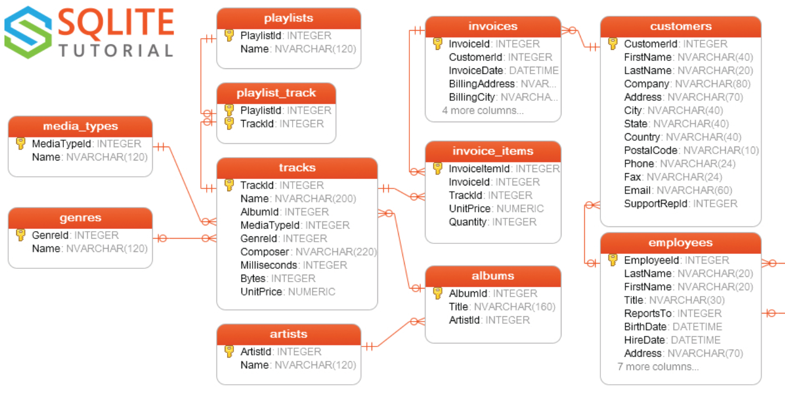

# CHINOOK BACKEND PROJECT

This is a project based on sqlite database called chinook obtained from SQLITE tutorial website.

The endpoints are deployed using flask.

The main routes are:
* /api/customer_login : Using email and password for customer login
* /api/customer_details/customerid : To Obtain the details of the customer
* /api/invoice_customer/customerid/pagenum: Once the user is logged in, whe can retrieve his/her invoices, the second parameter is for pagination. The API returns a key named "pages" to indicate the number of pages.
* /api/tracks_by_invoice/invoiceid/pagenum: Returns the tracks of an invoice
* /api/tracks_by_customers/customerid/pagenum: Returns the tracks owned by a customer
* /api/tracks_not_owned/customerid/pagenum: Returns the tracks not owned by a customer

The backend can be extended to support the purchase of new tracks, adding records to both invoices and invoice_items tables.

